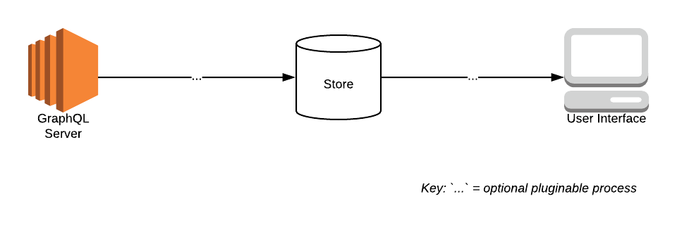
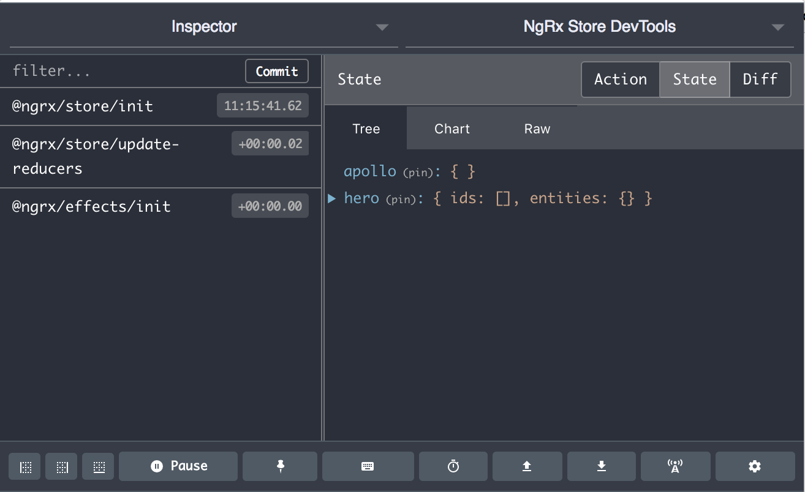
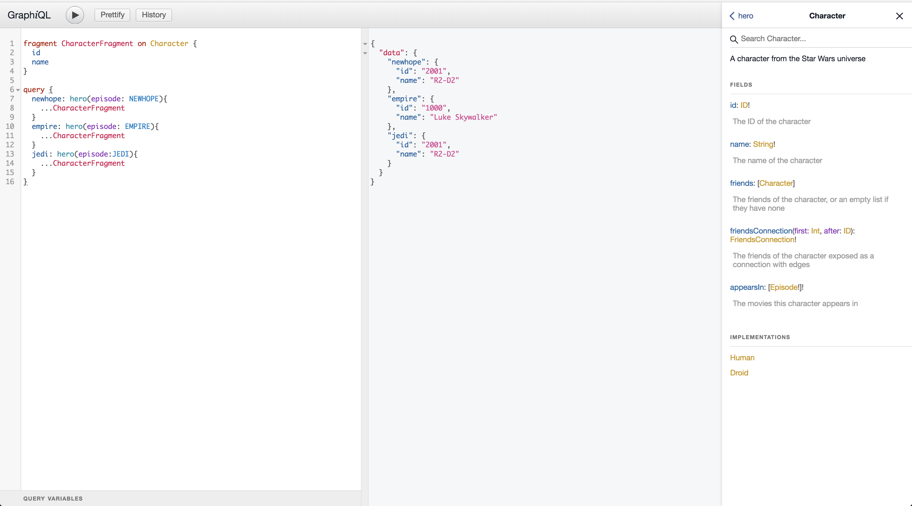

# GraphQL and NGRX in Angular 6.\*

**By Alejandro Quesada**

*If you discover any bugs or anything left to be desired - please leave an Issue or PR with the requested changes! I hope to have caught/considered everything, but if in your attempts to combine these two libraries, there is an issue that this repo neglects, let me know and I can make the proper adjustments. Thanks!*

## Requirements

- NPM@5^
- NodeJS@8^
- NG CLI: `npm i -g @angular/cli@latest`

## Goal

Quickly demonstrate (and provide the code/steps to) combining an NGRX Store with an Apollo GraphQL client.



## Execution

We will utilize a classic Star Wars GraphQL server. To start:

1. Run the executable for your OS in the `bin`.
2. Navigate to [http://localhost:8080](http://localhost:8080)
3. Feel free to run queries to get to know the API

Let's create a simple app that demonstrates an NGRX Effect for querying and running mutations in the GraphQL server. We will query for the heroes from the Star Wars movies and create reviews for the movies via mutations.

## Known Bugs or TODOS

- [ ] Fix CORS issue between `./bin` GraphQL server executables and the NG app (current approach in `feature-containerization` branch - if other ideas are suggested - please submit a GitHub PR or Issue).

## Getting Started

1. Add dependencies: `yarn add @ngrx/schematics`
2. Add dependencies: `yarn add @ngrx/{store,effects,entity,store-devtools}`
3. Add dependencies: `yarn add apollo-angular apollo-angular-link-http apollo-client apollo-cache-inmemory graphql-tag graphql`
4. Add dependencies: `yarn add apollo-angular-cache-ngrx`
5. Generate your Entities and initial Store:

   1. Using NG schematics, set NGRX schematics to the default collcetion (this will not affect `g c` or `g s`, etc: `ng config cli.defaultCollection @ngrx/schematics`
   2. Generate your root store and it's imports in `app.module.ts`: `ng g @ngrx/schematics:store State --root --module app.module.ts`
   3. Generate an `@ngrx/entity` called "Hero" (this will also generate boilerplate Actions and Reducers): `ng g en Hero --flat false --module app.module.ts`
   4. Generate an `@ngrx/effects` for "Hero": `ng g ef Hero --flat false --module app.module.ts`
   5. Generate an `@ngrx/entity` called "Review" (this will also generate boilerplate Actions and Reducers): `ng g en Review --flat false --module app.module.ts`
   6. Generate an `@ngrx/effects` for "Review": `ng g ef Review --flat false --module app.module.ts`

6. Setup `@ngrx/store` as the Apollo cache, original [article](https://medium.com/@charliegreenman/angular-using-ngrx-store-as-your-apollo-cache-with-graphql-d6c539932219):

   1. `app.module.ts` is as [#figure1](#figure1):
   2. The Store should look like [#figure2](#figure2) as seen in the Redux Devtools Chrome tools:

<a name="figure1"/>

```ts
// #figure1
...
import {
  NgrxCacheModule,
  NgrxCache,
  apolloReducer
} from 'apollo-angular-cache-ngrx';
...
    StoreModule.forRoot(
      { ...reducers, apollo: apolloReducer },
      { metaReducers }
    ),
    ...
    NgrxCacheModule
  ],
  ...
})
export class AppModule {
  constructor(ngrxCache: NgrxCache) {
    ngrxCache.create({});
  }
}
```



7. Let's define our models / gql fragments for `Review` and `Hero`

  1. `Hero`:

```ts
// `@app/hero/hero.model.ts`
export interface Hero {
  id: string; // needed for @ngrx/entity
  name: string;
}
```

```gql
# A Hero is a Character as of this GQL Provider
fragment CharacterFragment on Character {
  id
  name
}
```

  2. `Review`:

```ts
// `@app/review/review.model.ts`
export enum Episode {
  NEW_HOPE = 'NEWHOPE',
  EMPIRE = 'EMPIRE',
  JEDI = 'JEDI'
}
export enum Stars {
  ONE = 1,
  TWO = 2,
  THREE = 3,
  FOUR = 4,
  FIVE = 5
}

export interface Review {
  id: string; // needed for @ngrx/entity
  episode: Episode;
  stars: Stars;
  commentary: string;
}

```

```gql
fragment ReviewFragment on Review {
  stars
  commentary
}
```

8. Complete Apollo-Angular GraphQL Client configuration in `app.module.ts` (options include middlewares, caching strategies, etc): 

```ts
import { BrowserModule } from '@angular/platform-browser';
import { NgModule } from '@angular/core';
import { ReactiveFormsModule } from '@angular/forms';

import { AppComponent } from './app.component';
import { StoreModule } from '@ngrx/store';
import { reducers, metaReducers } from './reducers';
import { StoreDevtoolsModule } from '@ngrx/store-devtools';
import { environment } from '../environments/environment';
import * as fromHero from './hero/hero.reducer';
import { EffectsModule } from '@ngrx/effects';
import { HeroEffects } from './hero/hero.effects';

import { ApolloModule, Apollo } from 'apollo-angular';
import { HttpLinkModule, HttpLink } from 'apollo-angular-link-http';
import {
  NgrxCacheModule,
  NgrxCache,
  apolloReducer
} from 'apollo-angular-cache-ngrx';
import { ApolloLink, Operation } from 'apollo-link';

import { ReviewEffects } from './review/review.effects';
import * as fromReview from './review/review.reducer';
import { ReviewFormComponent } from './review-form/review-form.component';
import { HttpHeaders } from '../../node_modules/@angular/common/http';

@NgModule({
  declarations: [AppComponent, ReviewFormComponent],
  imports: [
    BrowserModule,
    ReactiveFormsModule,
    ApolloModule,
    HttpLinkModule,
    StoreModule.forRoot(
      { ...reducers, apollo: apolloReducer },
      { metaReducers }
    ),
    !environment.production ? StoreDevtoolsModule.instrument() : [],
    StoreModule.forFeature('hero', fromHero.reducer),
    StoreModule.forFeature('review', fromReview.reducer),
    EffectsModule.forRoot([HeroEffects]),
    EffectsModule.forFeature([ReviewEffects]),
    NgrxCacheModule,
  ],
  providers: [],
  bootstrap: [AppComponent]
})
export class AppModule {
  constructor(
    private apollo: Apollo,
    private httpLink: HttpLink,
    private ngrxCache: NgrxCache
  ) {
    const middleware = new ApolloLink(
      (operation: Operation, forward: any): any => {
        // If you were handling authentication, adding headers, etc
        const token = localStorage.getItem('access_token');
        if (token && !environment.production) {
          operation.setContext({
            headers: new HttpHeaders().set('Authorization', `Bearer ${token}`),
          });
        }
        return forward(operation);
      }
    );

    const http = this.httpLink.create({ uri: 'http://localhost:8080/query' });
    this.apollo.create({
      link: middleware.concat(http),
      cache: this.ngrxCache.create({}),

      // Further caching options
      defaultOptions: {
        watchQuery: {
          fetchPolicy: 'network-only',
          errorPolicy: 'ignore',
        },
        query: {
          fetchPolicy: 'network-only',
          errorPolicy: 'all',
        },
      },
    });
  }
}
```

9.  Let's dispatch an Action to load the heroes in the `app.component.ts`:

  1. Determine the Query via `http://localhost:8080`

  

  2. Place our query into `@app/hero` as `get-heros.gql`
  3. Mutate `app.component.ts` as follows:

```ts
// `app.component.ts`
import { Component, OnInit } from '@angular/core';
import { Store } from '@ngrx/store';
import { LoadHeros } from './hero/hero.actions';

@Component({
  selector: 'app-root',
  templateUrl: './app.component.html',
  styleUrls: ['./app.component.css']
})
export class AppComponent implements OnInit {
  constructor(private store: Store<any>) { }
  ngOnInit() {
    this.store.dispatch(new LoadHeros({ heros: [] }));
  }
}   
```

  4. The Redux Devtools will show us that the Action to `LoadHeros` will dispatch upon `app.component.ts` init.
  5. Have the Effect listen for the type and dispatch a query to the backend GraphQL service:

```ts
...
constructor(private actions$: Actions, private apollo: Apollo) { }

  @Effect()
  LoadHeros$ = this.actions$.pipe(
    ofType(HeroActionTypes.LoadHeros),
    switchMap(() => this.apollo.query({
      query: gql`
      fragment CharacterFragment on Character {
        id
        name
      }

      query GetHeroes {
        newHope: hero(episode: NEWHOPE){
          ...CharacterFragment
        }
        empire: hero(episode: EMPIRE){
          ...CharacterFragment
        }
        jedi: hero(episode: JEDI){
          ...CharacterFragment
        }
      }
      `,
    })),
    map(({ data }) => {
      // TODO given CORS issue during this quick instantiation, 
      // the contents of the response object may differ slightly - 
      // as in untested at the moment. -AQ 120818
      if (data) {
        const {
          GetHeroes: { newHope, empire, jedi }
        } = data;

        // massage data into Heroes Model
        return new UpsertHeros({ heros: List([newHope, empire, jedi]).map(({ id, name }) => ({ id, name })).toArray() });
      }
      // No data received, propogate error for handling elsewhere.
      throw Error();
    }),
    // Catching error will keep the Effect's pipeline from exiting (would be very bad).
    catchError(err => of(`Error: ${err}`))
  );
...
```

Now on app instantiation, the heroes will be immediately queried. Let's create a review now:

10. Generate a form to create episode reviews: `ng g c ReviewForm`
11. Create a bare bones `FormGroup`:

```ts
// @app/review-form/review-form.component.ts
import { Component, OnInit } from '@angular/core';
import { FormBuilder, Validators, FormGroup } from '@angular/forms';
import { Store } from '@ngrx/store';
import { AddReview } from '../review/review.actions';
import { Review } from '../review/review.model';

@Component({
  selector: 'app-review-form',
  templateUrl: './review-form.component.html',
  styleUrls: ['./review-form.component.css']
})
export class ReviewFormComponent implements OnInit {
  form: FormGroup;

  constructor(private fb: FormBuilder, private store: Store<any>) { }

  ngOnInit() {
    this.form = this.fb.group({
      stars: [0, Validators.required],
      commentary: ['', Validators.required],
    });
  }

  submit() {
    if (this.form.valid) {
      const {
        stars,
        commentary,
      } = this.form.value;
      this.store.dispatch(new AddReview({ review: <Review>{ id: Date.now().toString(), stars, commentary } }));
      this.form.reset();
    }
  }
}
```

12. When a user: 1) submits the form, 2) the form is validated then 3) `this.store.dispatch` an Action to `AddReview` to the local Store. We also want this to save to our external data store. Let's concoct am effect that listens for `AddReview` and dispatches a GraphQL `mutation` via the Apollo client library. 

```ts
// @app/review/review.effects.ts
import { Injectable } from '@angular/core';
import { Actions, Effect, ofType } from '@ngrx/effects';
import { ReviewActionTypes, AddReview } from './review.actions';
import { switchMap } from 'rxjs/operators';
import { Apollo } from 'apollo-angular';
import gql from 'graphql-tag';


@Injectable()
export class ReviewEffects {

  constructor(private actions$: Actions, private apollo: Apollo) { }

  @Effect()
  AddReviewOrigin$ = this.actions$.pipe(
    ofType(ReviewActionTypes.AddReview),
    switchMap((action: AddReview) => {
      return this.apollo.mutate({
        mutation: gql`
          mutation CreateReview {
            createReview(episode: NEWHOPE, review: {stars: 0, commentary: "Terrible"}) {
              stars
              commentary
            }
          }`,
        variables: {
          episode: action.payload.review.episode,
          review: {
            stars: action.payload.review.stars,
            commentary: action.payload.review.commentary,
          }
        }
      });
    })
    // Could have mapped response and stored locally, but instead - if user
    // posts a review locally, regardless of it successfully posting online,
    // they will see it in their UI. No further side effects required.
  );
}
```

Now when a user submits the form, the local UI will optimistically update AND our origin will update via GraphQL `mutation`.

To restrain from going any deeper on the subject, we have briefly combined NGRX and GraphQL (via simple `query` and `mutation`). Considering their strong typing and emphasis on messages, they are both highly composable and I find they work well together. Centralizing the Store benefits sanity greatly and leaves the door open for further pluggable components as the use cases increase in complexity. There is the field of thought that general data dependent components should perhaps be immediately dependent upon GraphQL as it's source of state, but barring circumstances, I quicker reason that the dumber a component - the better. By keeping state centralized in the application you maintain that everything is pluggable akin to Legos and ward off negative side-effects of distributed mutable state management. From a thought experiment and experience perspective, I have found it is easier to reason applications horizontal growth this way as both it and the contributing developer pool increase in quantity.

## Gotchas and Quick Fixes

- If you receive the following error: `node_modules/@types/graphql/subscription/subscribe.d.ts(17,12): error TS2304: Cannot find name 'AsyncIterator`. Append "esnext.asynciterable" to the "lib" of your `tsconfig.json` as so. [Original source for fix](https://github.com/apollographql/graphql-subscriptions/issues/83):

```json
{
    ...
    "typeRoots": [
      "node_modules/@types"
    ],
    "lib": [
      "es2017",
      "dom",
      "esnext.asynciterable"
    ]
  }
}
```

- If you get a static injection error for Actions, it is because the `StoreModule.forRoot()` needs to be imported before `EffectsModule.forRoot()`. If your `app.module.ts` has an `EffectsModule.forFeature([HeroEffects])` after step 5.1 above, then replace with `EffectsModule.forRoot([HeroEffects])`. The NG Schematics for NGRX occasionally generate this mistake. 

- Need to be in HTTPS? Create the follow `proxy.conf.js` file in the root directory:

```js
module.exports = [{
  context: ["/query"],
  target: "http://localhost:8080",
  secure: false,
  changeOrigin: true,
}]
```

Update the following section in `angular.json`

```json
        "serve": {
          "builder": "@angular-devkit/build-angular:dev-server",
          "options": {
            "browserTarget": "ng:build",
            "ssl": true,
            "proxyConfig": "./proxy.conf.js"
          },
          "configurations": {
            "production": {
              "browserTarget": "ng:build:production"
            }
          }
        },
```

You will now access your Angular site through `https://localhost:4200` by default.

## Extra Credit

- Send more efficient queries with persisted queries. Possible Apollo implementation: [https://github.com/apollographql/apollo-link-persisted-queries](https://github.com/apollographql/apollo-link-persisted-queries), [https://blog.apollographql.com/persisted-graphql-queries-with-apollo-client-119fd7e6bba5](https://blog.apollographql.com/persisted-graphql-queries-with-apollo-client-119fd7e6bba5)
- A few articles I quickly read up on gRPC, REST and GraphQL that may or may not be interesting - some of the takeaways is that RPC is back with a vengeance: [https://blog.apisyouwonthate.com/understanding-rpc-rest-and-graphql-2f959aadebe7](https://blog.apisyouwonthate.com/understanding-rpc-rest-and-graphql-2f959aadebe7), [https://sites.google.com/a/athaydes.com/renato-athaydes/posts/thereturnofrpc-orhowrestisnolongertheonlyrespectablesolutionforapis](https://sites.google.com/a/athaydes.com/renato-athaydes/posts/thereturnofrpc-orhowrestisnolongertheonlyrespectablesolutionforapis)
